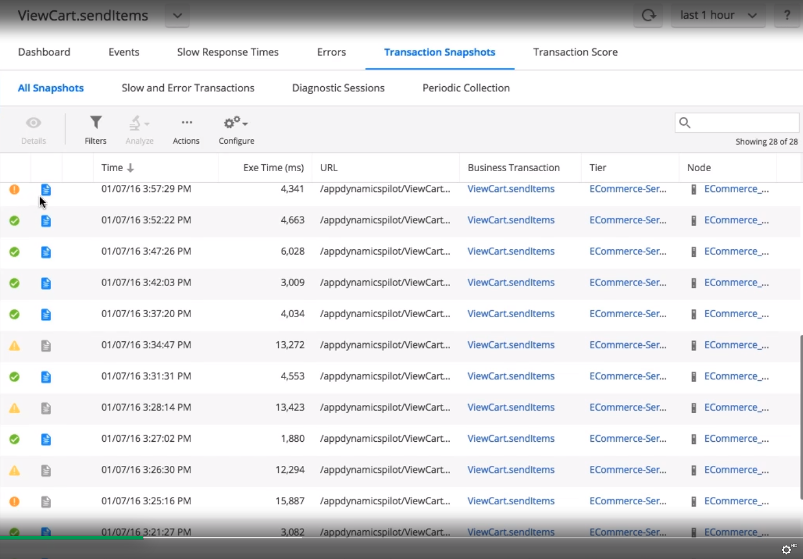
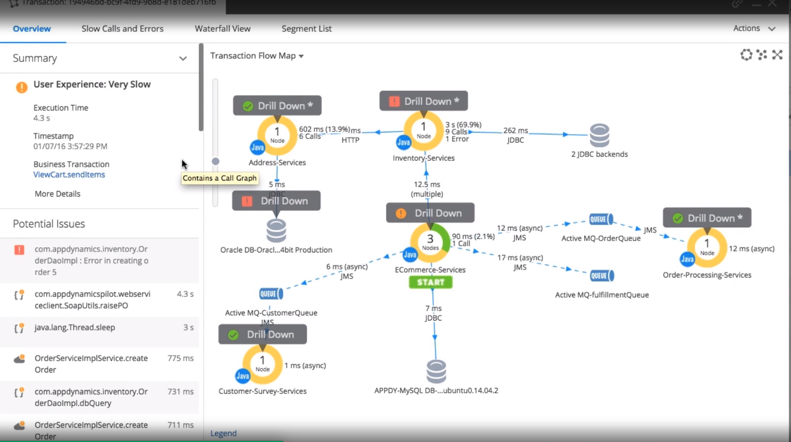
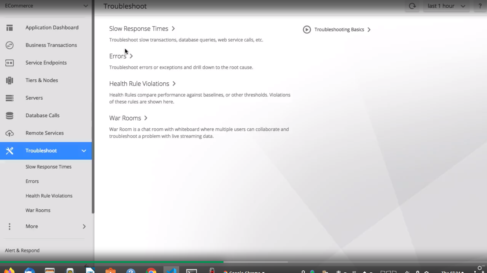
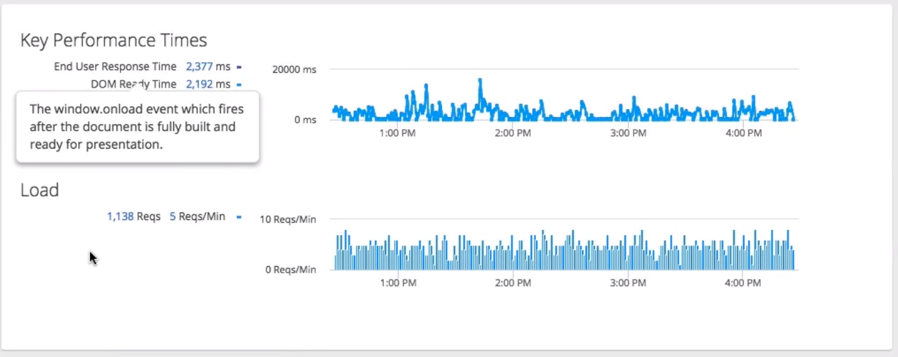
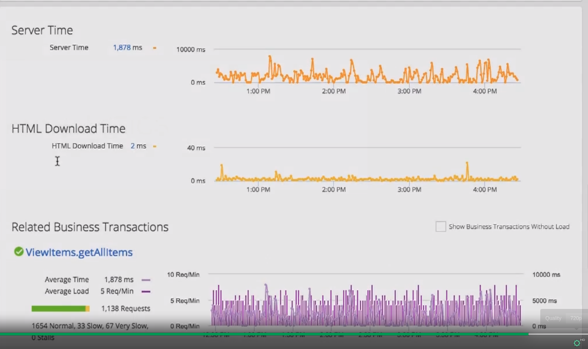

# [App Dynamics APPD docs](https://docs.appdynamics.com/)

# [How AppDynamics Works](https://www.appdynamics.com/ui/45/videos/VIDEO_HOW_AD_WORKS)

## Application Monitoring

After installing App Agent it will automatically discover services on the host.

Then it will start to report performance metrics back to the controller.

In this "Application Flow Map" you can see how App Agent has discovered:

- all jvms that make up this ecommerce app.

- and the backend calls to message queues and DBs

- dashed lines between componens shows async activity

- the legend helps you identify elements on the flow map

## Supported Languages

APPD auto discovers apps in dotnet, php, python, nodejs, as well as calls to all kinds of remote services. 

You can use agent sdk to monitor C++ apps.

## Supported frameworks

## Business Transactions (BTS)

APPD auto discovers incoming customer requests and defines them as business transactions. Those can be like checking account balances, searching air fairs, or adding items to shopping carts. 

APPD traces transaction flow via various points of you app and compares the performance of various BTs to dinamically calculate baselines - that way you can easily filter slow BTS.

BT List displays health, avg response time, volume (calls), and throughtput sum (calls/min). 

### BT item

We can see aggregated view of some BT by clicking it.

#### Aggregated view of BT

#### Snapshots view of BT

Also we can see individual transaction snapshots and diagnose the problematic ones in the tab.

#### Flow map of execution for BT

Here the flow map is specific to particular execution of transaction. 

Summary shows overwiev of BT timing

Potential issues 

##### Slow calls and errors tab

We can have waterfall view of chronological order of methods execution.

## Troubleshooting (TBS) built in

### Slow Response Times

### (Snapshots for) Errors BT

### Health Rules

APPD allows to specify health rules to find acceptable performance thresholds for your app. 

When things go wrong and your app violates the health rules you can quickly see which components of your app were affected. 

Then you can drill in specific timeframe snapshot dashboard of the violation.

## Alert and respond

APPD let you to set up policies that would trigger automated actions based on health rule violations and other system events.

## Metric browser

Select and compare metrics for components in your environment. 

For example you can show how avg response time for a BT correlates to the memory and use of an app server - during a specific timeframe. 

## Database Monitoring

APPD integrated DB monitoring.

It gives you a real time view in the DBs. 

### Hardware usage

That show hardware usage like:

- CPU and RAM usage 

- query wait states

- database sessions

### Queries

We can view the top sql statements and queries

with their query details

and exectution plans

## End user monitoring

Performance information from the client perspective:

- web browser clients 

- mobile app clients. 

### Synthetic browse monitoring

You can also setup a synthetic browser monitoring jobs that generate performance data regardles of the load generated by real users base. 

### Browser real monitoring

After you set up real time browser monitoring we can view the performance statistics in the dashboards. 

Bye default the overview shows high level performance indicators like

- end user response time distribution

- end user response time trends

#### Pages & AJAX Reguests

Shows all client requests that You can drill in. 

You can drill in and see a dashboard for specific request 

W

##### Timing breakdown

Shows how much time the user request spent in each phase of processing. From first response time to when page fully loaded. 

##### Compare web page performance vs server response times

##### Drill into related BTS on server side

## Application Analytics

Aggregates all data across:

- BTS, 
- logs files, 
- browser and mobile data, 

Then you can see critical intelligence about your application performance and user expiriences.

### Query specific data

For example you can query on hits of a browser page that take longer than two seconds.

### Critical fields 

Choose fields that are ciritical to you and see summary statiscits for them

